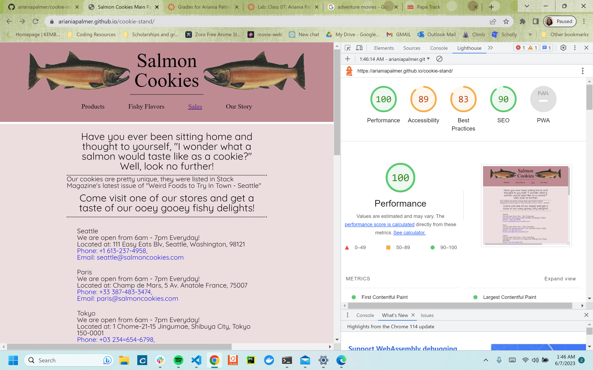

# Cookie-Stand
Code 201: Labs 6 - 9

## Cookie-Stand
This app takes the user to a landing page where they may view the store information and products of the salmon cookie franchise. The user is then able to populate their own store totals on the sales page by inputing the minimum prospective customers, maximum prospective customer, prospective average cookies sold per customer, and the the Name of the prospective location. The prospective location is then added to the sales table with rendered daily and hourly totals using the values given, and the user is able to see the impact their prospective store has on the franchise's grand total.

### Author: Ariania Palmer

### Links and Resources

* [Styled in tandem with Myer Web's reset stylesheet](http://meyerweb.com/eric/tools/css/reset/)

### Lighthouse Accessibility Report Score

* Accessibility score

### Reflections and Comments

